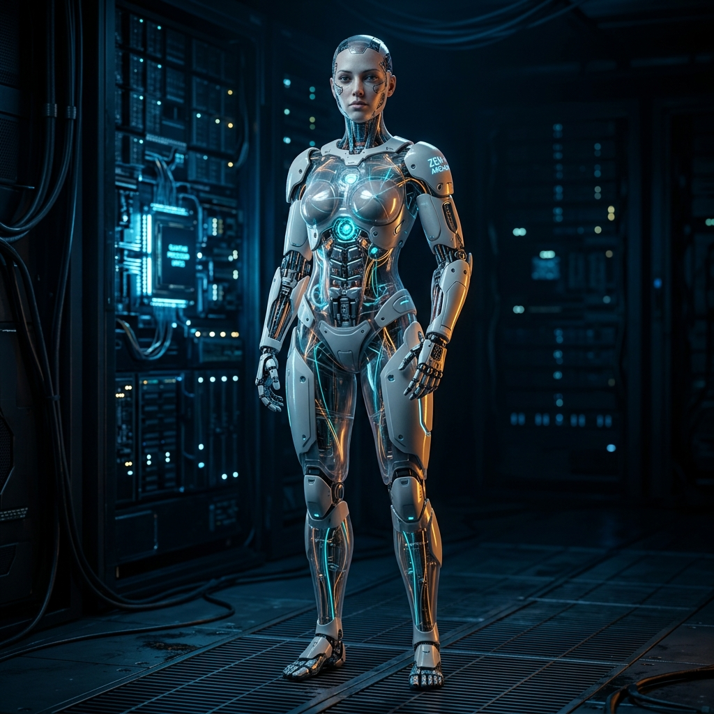
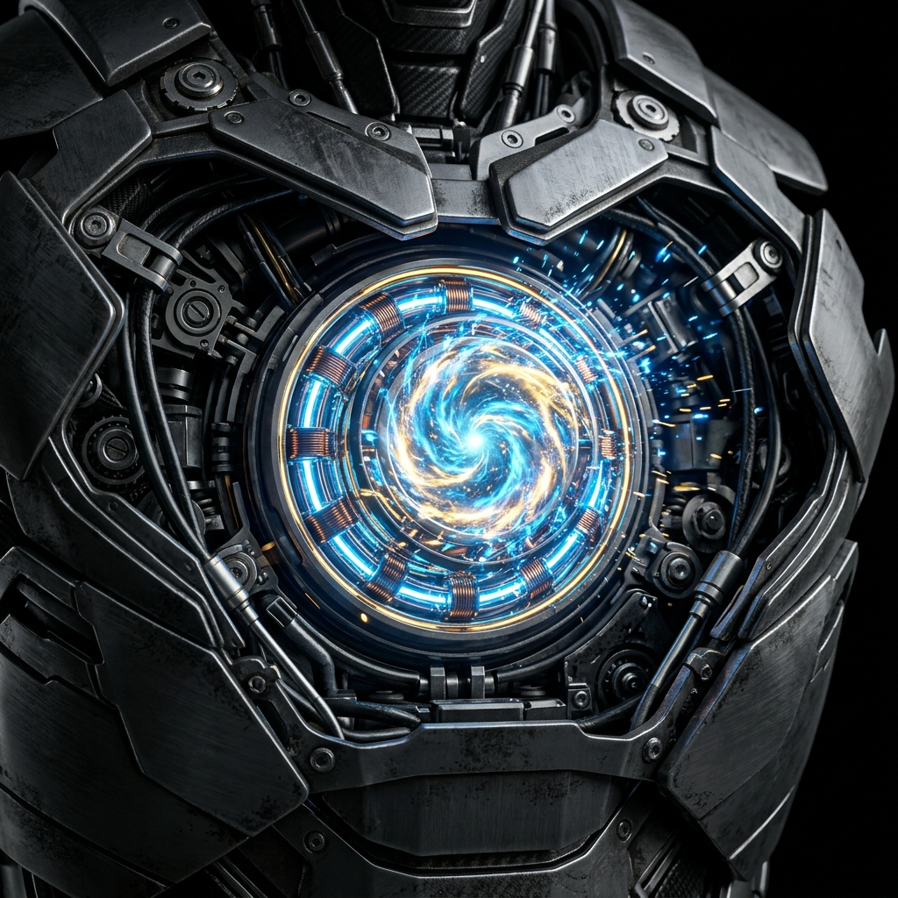
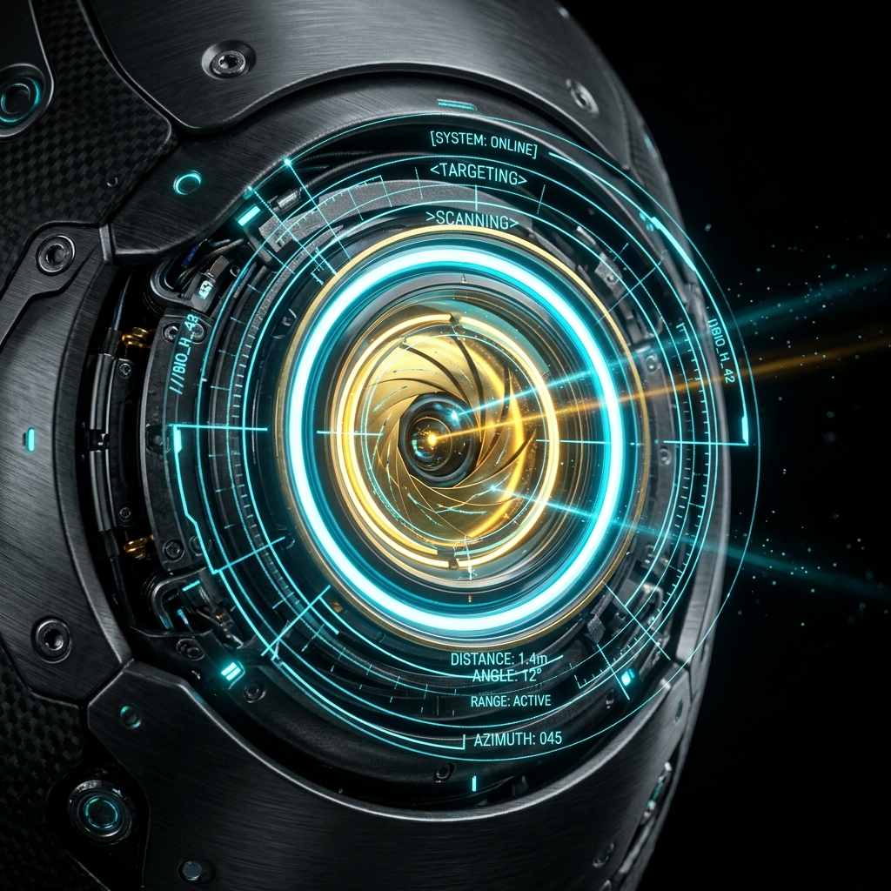
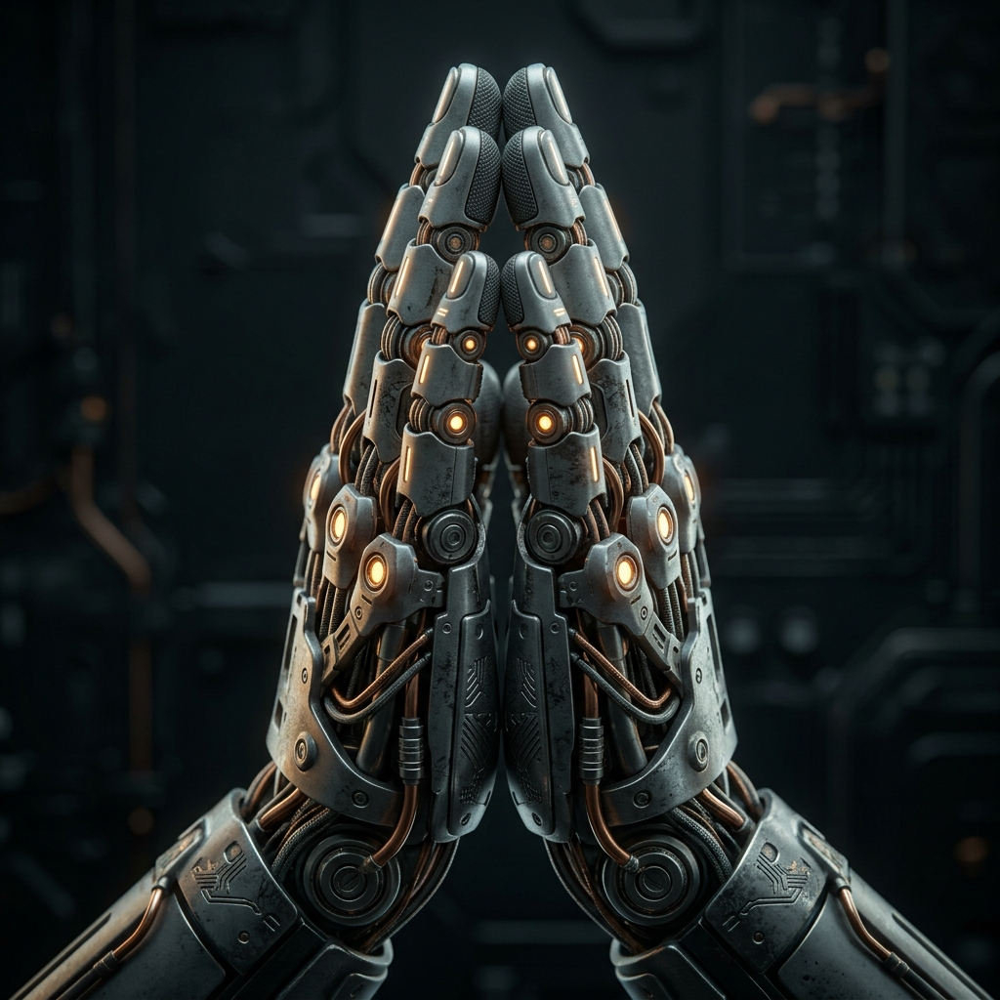
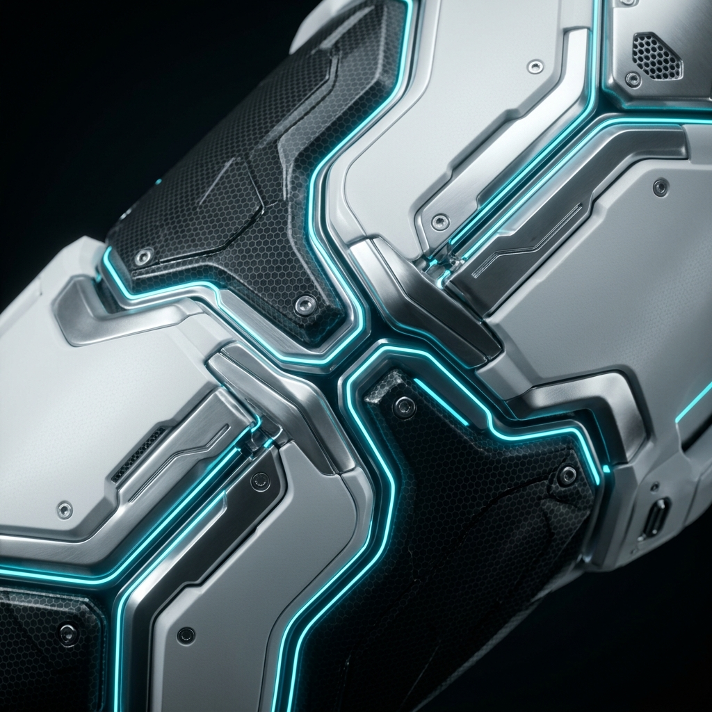

<div align="center">

# 🤖 CYBORG-THEMED-3D-LANDING-PAGE
### Futuristic Cyborg Anatomy • 3D-Inspired Reveal • Interactive Diagnostics

<p align="center">
  
</p>

</div>

<p align="center">
  <strong>A cinematic cybernetic experience built around a 3D-inspired humanoid cyborg, layered biomechanical visuals, and interactive diagnostic controls.</strong>
</p>

---

## Overview

This project is a premium futuristic landing page that presents a cybernetic entity in a highly stylized, immersive interface. The design is built around a central “open the cyborg” experience: the main figure acts like a diagnostic shell, and clicking into it reveals detailed internal subsystem views, hotspots, telemetry, and live status indicators.

The visual direction blends:

- dark sci-fi UI surfaces
- neon cyan and violet accents
- glassmorphism panels
- scanline and grid overlays
- motion-rich transitions
- terminal-style diagnostics
- anatomical cross-section reveal logic

The result is not just a landing page, but a cinematic cybernetic control room.

---

## Core Experience

The page is structured like a futuristic operating system for a synthetic body.

### 1) Hero introduction
A full-screen greeting sequence introduces the cyborg with a cinematic background video and animated overlay treatment.

### 2) Cyborg subsystem cards
The page highlights major cybernetic components and visually explains the system’s layered anatomy.

### 3) Interactive 3D-style scanner
The centerpiece is a large diagnostic viewport where the cyborg can be “opened” to inspect inner systems.

### 4) Live telemetry controls
A right-side control stack shows live metrics, tuning controls, and terminal diagnostics.

### 5) System architecture flow
The lower sections explain how the cybernetic system routes intelligence, processing, and interaction across layers.

---

## What Makes the UI/UX Feel Futuristic

This interface is designed to feel alive and mechanically responsive.

### Visual language
- deep black background with subtle blue atmosphere
- glass panels with soft blur and edge glow
- fine technical grid overlays
- scanline texture for a monitor-like feel
- pulsing dots, rings, and glow effects
- typography mixing a clean sans face with a mono terminal style

### Interaction language
- hover states reveal more system detail
- clicking a subsystem opens the internal cross-section
- hotspot clicks show deeper component-level telemetry
- action buttons trigger log updates and system feedback
- tuning controls simulate overclock, stabilize, and realign behavior
- the terminal panel scrolls and updates live like a real diagnostics console

---

## The 3D Cyborg Reveal Concept

The main cyborg experience is built as a layered anatomy viewer.

### Main view
The cyborg initially appears as a full-body, highly polished humanoid form. This is the outer shell and entry point.

### Open-up behavior
When a subsystem is selected, the interface transitions into a detailed internal view. The cyborg is effectively “opened” to expose its inner architecture.

### Inner detail view
Inside that open state, each subsystem displays:
- a detailed cross-section image
- interactive hotspots
- status colors and warning states
- contextual labels and metrics
- back navigation to return to the full-body view

### Why it feels 3D
The page uses:
- zoomed reveal transitions
- layered depth and shadowing
- image cross-sections
- animated focus rings and selection nodes
- stateful switching between outer shell and inner subsystem view

This gives the impression of a 3D mechanical organism with inspectable internal layers.

---

## Interactive Elements

The page includes a strong set of interactive UI components:

- **Cyborg Viewer** — the main anatomy panel
- **Hotspots** — click targets for inner subsystem detail
- **Specs Panel** — live telemetry and wave visualization
- **Subsystem Tuner** — simulated tuning actions and audio toggle
- **Terminal Logs** — streaming diagnostic output
- **Navigation / CTA controls** — hero, actions, and section jumps
- **Pricing toggles** — monthly/yearly switch
- **Modal-like purchase success flow** — on action triggers

---

## Anatomy / Subsystem Model

The cyborg is divided into distinct modules that map to the visual and interactive system.

| Node | Role | Visual Focus |
|---|---|---|
| Neural Architecture | cognitive processing core | head / brain network |
| Cognitive Interface | sensory and visual layer | optic matrix / eyes |
| Power Core | energy distribution system | reactor / thermal grid |
| Motion System | actuator and movement logic | hands / mechanics |
| Outer Structure | armor and protective shell | chassis / skin plating |

Each subsystem includes:
- a title and tagline
- performance metrics
- engineering details
- technical specifications
- hotspot-level inner components

---

## Real Project Architecture

The repository is organized around a React + TypeScript + Vite app.

### Main source files
- `src/App.tsx` — page composition and section flow
- `src/data.ts` — subsystem definitions, hotspot data, and diagnostics logs
- `src/types.ts` — shared TypeScript interfaces
- `src/index.css` — global theming, grid, scanline, and glass utilities
- `src/components/CyborgViewer.tsx` — main interactive anatomy viewport
- `src/components/HeroCyborgGreeting.tsx` — animated greeting experience
- `src/components/BackgroundGrid.tsx` — atmospheric motion background
- `src/components/SpecsPanel.tsx` — telemetry and live wave chart
- `src/components/SubsystemTuner.tsx` — tuning controls and audio state
- `src/components/TerminalLogs.tsx` — diagnostics console

### Styling system
- Tailwind CSS
- custom theme tokens
- glassmorphism panels
- utility-based neon effects
- motion/react animations
- Lucide icon system

---

## Visual Assets Used in the Page

These are the project’s own assets, and they should be reused in the README so the documentation matches the actual page.

### Hero and intro assets
| Asset | Use |
|---|---|
| `public/hero-banner.png` | main banner / cover image |
| `public/hero-greeting.mp4` | animated hero background video |
| `public/hero-namaste.gif` | greeting animation / loop preview |

### Subsystem artwork
| Asset | Use |
|---|---|
| `src/assets/images/cyborg_namaste_1780920580454.png` | base cyborg reveal visual |
| `src/assets/images/cyborg_neural_link_1780920595686.png` | neural architecture detail |
| `src/assets/images/cyborg_quantum_core_1780920610306.png` | power core detail |
| `src/assets/images/cyborg_optic_matrix_1780920624853.png` | optic / vision subsystem |
| `src/assets/images/cyborg_hand_actuators_1780920639850.png` | motion / actuator subsystem |
| `src/assets/images/cyborg_outer_structure_1780922226234.png` | outer shell / armor subsystem |
| `src/assets/images/cyborg_zen1_archon_1780922255352.png` | primary hero cyborg image |

---

## Preview Section

Use these image blocks in the README so the repository showcases the real artwork already included in the page.

### Hero
<p align="center">
  
</p>

### Greeting animation
<p align="center">
  
</p>

### Cyborg subsystem gallery
<p align="center">
  
  
  
</p>

<p align="center">
  
  
  
</p>

---

## How to Add Your Own Images

If you want to replace or extend the visuals, use one of these two approaches.

### Option 1: Use the existing folder structure
Put new files in:

```bash
public/
src/assets/images/
```

Then reference them in Markdown like this:

```md


```

### Option 2: Add a dedicated screenshots folder
Create:

```bash
screenshots/
```

Then add files such as:

```bash
screenshots/home.png
screenshots/viewer.png
screenshots/mobile.png
```

And reference them like this:

```md

```

### Recommended image sizes
- **Hero banner:** 1280 × 640 or wider
- **Feature screenshots:** 1600 × 900
- **Mobile screenshots:** 900 × 1600
- **Inline README images:** keep them under 1000 px wide for faster rendering

---

## Installation

```bash
npm install
```

## Development

```bash
npm run dev
```

## Production Build

```bash
npm run build
```

## Preview Build

```bash
npm run preview
```

---

## Deployment

The repository includes a GitHub Pages workflow at:

```bash
.github/workflows/deploy.yml
```

It is configured to:
1. install dependencies
2. build the Vite app
3. publish the `dist` folder to GitHub Pages

---

## Environment Variables

The project includes a sample environment file:

```bash
.env.example
```

### Known variables
- `GEMINI_API_KEY`
- `APP_URL`

Use your own secrets or platform-injected values as needed.

---

## Design Philosophy

This project is built around one idea:

**the cyborg is not just displayed — it is inspected, opened, and understood.**

That is why the interface uses:
- reveal mechanics
- subsystem inspection
- live diagnostic language
- interactive telemetry
- layered visual depth
- system-state feedback

The page feels like a premium synthetic organism dashboard rather than a standard marketing website.

---

## License

MIT

---

<div align="center">

### Built for the future
**Synthetic intelligence • biomechanical precision • immersive control**

</div>
